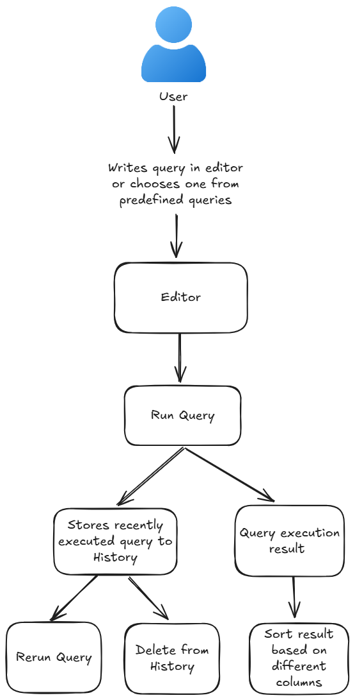
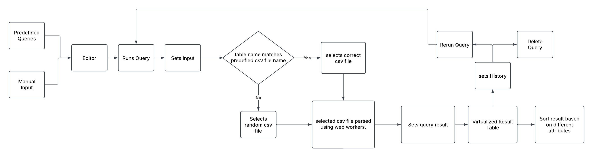

# MockQL

  

## 📌 Overview

MockQL is an interactive SQL query execution platform that allows users to write, execute, and manage SQL queries efficiently. Designed for usability and performance, MockQL provides a seamless data exploration experience with essential and advanced functionalities such as query history, virtualized tables, and sorting.

- **Website:** [MockQL Live](https://mock-ql.vercel.app/)
- **GitHub Repository:** [MockQL GitHub](https://github.com/Prasad2604/MockQL)

📌 Video Demonstration

[MockQL Demo Video](https://www.loom.com/share/8ea895c101764c4f8162cf4dc593a2db?sid=e72ba5a2-bdca-4e0d-981c-1c7dea3c992e)

## 📌 Tech Stack

MockQL is built using modern web technologies to ensure high performance and a great user experience:

- **Frontend:** React, TypeScript
- **State Management:** React Hooks
- **UI Framework:** Material-UI (MUI) (@mui/material), Material-UI Icons (@mui/icons-material)
- **Code Editor:** CodeMirror (@codemirror)
- **Data Processing:** Web Workers for CSV parsing
- **Virtualized Rendering:** react-window
- **Build Tools:** Vite/Webpack
- **Deployment:** Vercel

## 📌 Features

### Core Features:

- **SQL Query Editor:** A full-featured SQL editor for writing and running queries.
- **Predefined Queries:** Dropdown selection of commonly used queries for easy execution.
- **Results Table:** Displays the output of executed queries in a structured format.

### Advanced Features:

- **Query History:** Keeps track of previously executed queries for easy reference.
- **Virtualized Table Rendering:** Optimized performance for handling large datasets using react-window.
- **Sorting:** Users can sort query results within the results table.
- **Rerun Query from History:** Users can run previously executed queries from history.

## 📌 User Experience Considerations

MockQL is designed with an intuitive layout and user-friendly controls:

- **Responsive Design:** Works across different screen sizes, ensuring usability on desktops and tablets.
- **Instant Feedback:** Provides loading indicators, error messages, and success notifications for user actions.
- **Minimalistic UI:** Keeps the interface clean and distraction-free while maintaining functionality.

## 📌 User Flow

  

1. **User Input:** The user writes a new SQL query in the editor or selects a predefined query.
2. **Query Execution:** The query is processed and executed.
3. **Result Handling:** The executed query returns a result set, which can be sorted based on different columns.
4. **Query History Management:** Successfully executed queries are stored in history for future reference.
5. **History Actions:** Users can rerun past queries or delete them from history as needed.

## 📌 Application Architecture

  

MockQL follows a modular and scalable architecture with the following components:

- **Query Input & Execution:**
  - Users can input queries manually or select from predefined queries.
  - The query is entered into the SQL editor.
- **Query Processing & History Management:**
  - The query is executed and stored in history for reruns or deletion.
  - Lazy loading optimizes performance by only loading necessary components when required.
- **CSV Selection & Parsing:**
  - The system checks if the table name in the query matches a predefined CSV file.
  - Web Workers handle CSV processing asynchronously to ensure UI responsiveness.
- **State Management & Query Result Handling:**
  - The selected CSV file is parsed, and the query result is set.
  - React Hooks efficiently update state without unnecessary re-renders.
- **Rendering Results Efficiently:**
  - Virtualized result table displays processed data using react-window.
  - Lazy loading ensures only visible rows are rendered, improving performance for large datasets.

## 📌 Performance & Optimizations

MockQL is optimized for high performance using:

- **Web Workers:** Parsing large CSV files in a separate thread to prevent UI blocking.
- **Virtualized Tables:** Efficiently rendering large datasets using react-window.
- **Code Splitting & Lazy Loading:** Reducing initial load time by loading components on demand.
- **Optimized Event Handling with useCallback:** Prevents unnecessary re-creation of functions, improving performance in query execution and result table interactions.

## 📌 Lighthouse Performance Scores

- **Navigation Test:** High efficiency for seamless navigation.
- **Timespan Test:** Optimized response times for query execution.
- **Snapshot Test:** Smooth UI rendering and interactions.

## 📌 Conclusion

MockQL is a powerful, user-friendly SQL query execution tool designed for efficiency and usability. With advanced features like query history, virtualized rendering, and Web Worker-based parsing, it offers a seamless and high-performance experience. Its modular architecture ensures scalability, making it an ideal solution for executing and managing SQL queries in real-time environments.
